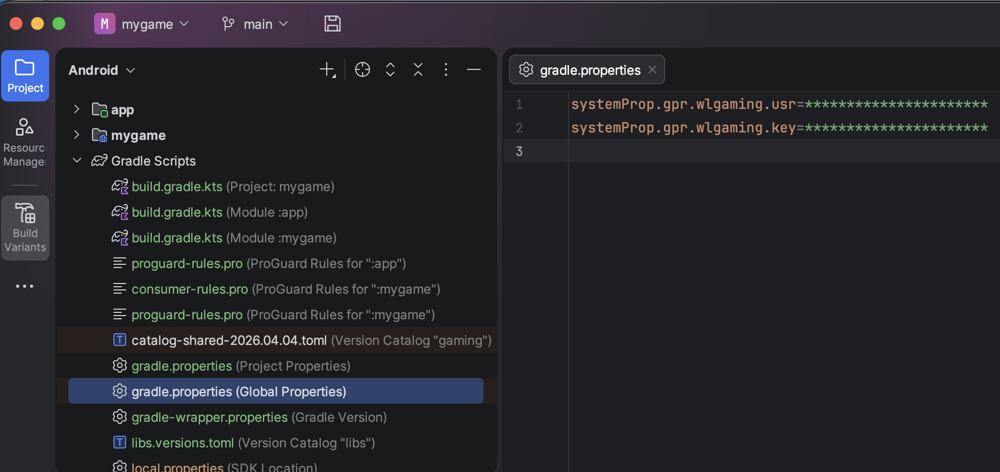
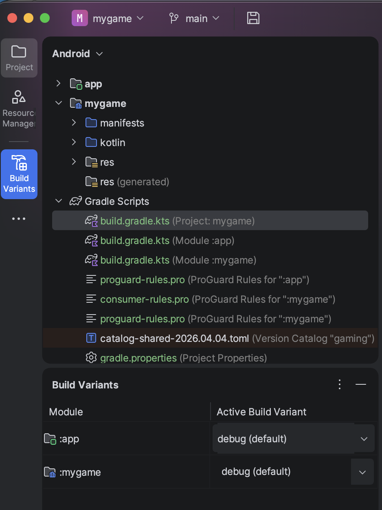

# Gaming Starter Kit (POC) for game development for Android

This is a sample (POC) project to start developing a game for Gaming platform for Android.
You can use it as a base project for your game or use it just as en example.

1. [Start using starter kit](#1-start-using-starter-kit)
2. [Developing the game](#2-developing-the-game)
    1. [Components](#1-components)
    2. [Build variants (environments)](#2-build-variants-environments)
    3. [Publishing game library](#3-publishing-game-library)

***

## 1. Start using starter kit

1. Clone this repo.
2. **Remove the current origin** and add your own repo origin.
3. Setup access to the **EngageCraft Maven repositories** on your global Gradle properties (**systemProp**) or set them as ENV variables.



4. Initialize game project by running the following command (`gameId` and `publishingUrl` will be provided to you by EngageCraft team):
```
./gradlew initgame --gameId=mygame --publishingUrl=https://example.com/maven
```

> ❗ **IMPORTANT**
>
> Game namespace pattern: `com.engagecraft.gaming.__GAME_ID__`
>
> Every game **must** use this package namespace so we can dynamically load the game components on Gaming app or on Gaming developing tools.

***

## 2. Developing the game

ℹ️ [DEVELOPMENT DOCUMENTATION](https://example.com/Android+Game+development)

***

### 1. Components

Every game **must** have at least one public component. If the game is a full-featured game it must have `Game` component. If game must provide Featured Card component it must have `Card` component. They are two main entry points to the game.

Those two components can be a native views (extends View, FrameView or etc.) or they can be `@Composable` components (💡 **preferred**).

The starter kit provides sample `@Composable Game` and `@Composable Card` components.

> ❗ **IMPORTANT**
>
> All other game components, classes, constant etc. must be either `internal` or `private`. Game resources (drawables, strings, layout files and etc.) must have [prefix](https://developer.android.com/studio/projects/android-library#Considerations) (e.g. `gameid_`) and must be [private too](https://developer.android.com/studio/projects/android-library#PrivateResources). In general game library should not expose anything except for `Card` and/or `Game` components.
>
> 
> If the game project has more than one module (multiple game themes) and it does have a shared module it should use prefix too. As it cannot use gameId as a prefix it may be constructed like this: `gaming_fantasy`, or `gaming_fantasy_core` (gaming prefix followed by generic game name without competition prefix).

***

### 2. Build variants (environments)

There are 3 preconfigured build variants for the dev app:
1. `debug` - A build variant on **INT** environment. Intended for developing/testing purposes.
2. `pre` - A build variant on **PRE** environment. Intended for CI builds and testing before releasing a new version of the app.
3. `release` - A build variant on **PROD** environment. Intended for checking on production. ⚠️ **CAUTION** while using it.

You can change variant (environment) the using build variant selection on Android Studio:



***

### 3. Publishing game library

> ❗ **IMPORTANT**
> 
> Every game must publish on a private EngageCraft Maven repo so it could be added to the Gaming app as a Gradle dependency.


#### Publishing a game

Update the project version on project's `build.gradle` and run
```
./gradlew publish
```

#### Nightly (snapshot) builds

For the nightly builds we will use *Maven snapshots*. Snapshots do not require to change the version number for every new release so it simplifies automated build setup.
For now, we'll use `0.0.0` version for the snapshots, and we'll update it once we see a need for that.
To release a new snapshot just run
```
./gradlew -Psnapshot publish
```
